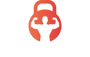

<!-- Improved compatibility of back to top link: See: https://github.com/othneildrew/Best-README-Template/pull/73 -->

<a id="readme-top"></a>

<!--
*** Thanks for checking out the Best-README-Template. If you have a suggestion
*** that would make this better, please fork the repo and create a pull request
*** or simply open an issue with the tag "enhancement".
*** Don't forget to give the project a star!
*** Thanks again! Now go create something AMAZING! :D
-->

<!-- PROJECT SHIELDS -->
<!--
*** I'm using markdown "reference style" links for readability.
*** Reference links are enclosed in brackets [ ] instead of parentheses ( ).
*** See the bottom of this document for the declaration of the reference variables
*** for contributors-url, forks-url, etc. This is an optional, concise syntax you may use.
*** https://www.markdownguide.org/basic-syntax/#reference-style-links
-->

[![Contributors][contributors-shield]][contributors-url]
[![Forks][forks-shield]][forks-url]
[![Stargazers][stars-shield]][stars-url]
[![Issues][issues-shield]][issues-url]
[![Unlicense License][license-shield]][license-url]
[![LinkedIn][linkedin-shield]][linkedin-url]

<!-- PROJECT LOGO -->
<br />
<div align="center">
  
  <h3 align="center">Xtreme Fitness Web Platform</h3>
  <p align="center">
    Moderne fitnessklub hjemmeside med blog, trænere, tjenester, abonnementer og admin backoffice.<br />
    <strong>React + Vite + Tailwind + Node.js API</strong>
    <br />
    <a href="https://github.com/sleiterr/xtremeFitness_fagproeve/tree/main/xtreme_fitness_materials/docs"><strong>Læs dokumentation »</strong></a>
    <br />
    <br />
    <a href="#usage">Se Demo</a>
    &middot;
    <a href="#issues">Rapportér fejl</a>
    &middot;
    <a href="#features">Foreslå funktion</a>
  </p>
</div>

<!-- TABLE OF CONTENTS -->
<details>
  <summary>Table of Contents</summary>
  <ol>
    <li>
      <a href="#about-the-project">About The Project</a>
      <ul>
        <li><a href="#built-with">Built With</a></li>
      </ul>
    </li>
    <li>
      <a href="#getting-started">Getting Started</a>
      <ul>
        <li><a href="#prerequisites">Prerequisites</a></li>
        <li><a href="#installation">Installation</a></li>
      </ul>
    </li>
    <li><a href="#usage">Usage</a></li>
    <li><a href="#roadmap">Roadmap</a></li>
    <li><a href="#contributing">Contributing</a></li>
    <li><a href="#license">License</a></li>
    <li><a href="#contact">Contact</a></li>
    <li><a href="#acknowledgments">Acknowledgments</a></li>
  </ol>
</details>

<!-- ABOUT THE PROJECT -->

## Om Projektet

Xtreme Fitness Web Platform er en moderne webapplikation til et fitnesscenter, med følgende funktioner:

- Dynamisk forside med klubinformation, tjenester, trænere og anmeldelser
- Blogsystem med CRUD (opret, rediger, slet) for administratorer
- Brugergodkendelse og beskyttet admin backoffice
- Abonnements- og kontaktformularer
- Responsivt, mobilvenligt design
- Admin dashboard til håndtering af blogs, trænere, tjenester og brugere

<p align="right">(<a href="#readme-top">tilbage til toppen</a>)</p>

### Built With

### Bygget med

- [React](https://reactjs.org/)
- [Vite](https://vitejs.dev/)
- [Tailwind CSS](https://tailwindcss.com/)
- [Node.js](https://nodejs.org/) + [Express](https://expressjs.com/) (API)
- [Formik](https://formik.org/) + [Yup](https://github.com/jquense/yup) (formularer & validering)
- [React Router](https://reactrouter.com/)
- [React Toastify](https://fkhadra.github.io/react-toastify/)

<p align="right">(<a href="#readme-top">back to top</a>)</p>

<!-- GETTING STARTED -->

## Getting Started

## Kom godt i gang

Sådan kører du projektet lokalt:

### Forudsætninger

- Node.js >= 18
- npm >= 9

### Installation

1. Klon dette repository

```sh
git clone https://github.com/your_username/xtreme_fitness_materials.git
cd xtreme_fitness_materials
```

2. Installer afhængigheder

```sh
npm install
```

3. Kopiér .env.example til .env og angiv din API URL hvis nødvendigt
4. Start udviklingsserveren

```sh
npm run dev
```

<p align="right">(<a href="#readme-top">back to top</a>)</p>

<!-- USAGE EXAMPLES -->

## Usage

## Brug

- Besøg forsiden for at se klubinfo, tjenester, trænere og anmeldelser
- Brug blogsektionen til at læse artikler (admin kan tilføje/redigere/slette blogs i Backoffice)
- Registrér/login for at få adgang til beskyttet admin dashboard
- Administrér indhold (blogs, trænere, tjenester, brugere) via Backoffice

_For flere detaljer, se koden og kommentarer i repositoryet._

<p align="right">(<a href="#readme-top">back to top</a>)</p>

<!-- ROADMAP -->

## Roadmap

- [x] Responsiv forside
- [x] Blog CRUD for administratorer
- [x] Håndtering af trænere og tjenester
- [x] Brugergodkendelse & beskyttede ruter
- [x] Backoffice dashboard
- [ ] Enheds- & integrationstests
- [ ] Flersproget support

See the [open issues](https://github.com/sleiterr/xtremeFitness_fagproeve/commits/main/) for a full list of proposed features (and known issues).

<p align="right">(<a href="#readme-top">back to top</a>)</p>

<!-- CONTRIBUTING -->

## Contributing

## Bidrag

Bidrag, fejl og funktionsønsker er velkomne! Fork gerne repoet og opret en pull request.

<p align="right">(<a href="#readme-top">back to top</a>)</p>

<!-- LICENSE -->

## License

Distribueret under MIT-licensen. Se `LICENSE` for mere information.

<p align="right">(<a href="#readme-top">back to top</a>)</p>

<!-- CONTACT -->

## Contact

Forfatter: Oleg Troian (tilføj dine kontaktoplysninger her)

Projektlink: [https://github.com/sleiterr/xtremeFitness_fagproeve](https://github.com/sleiterr/xtremeFitness_fagproeve)

<p align="right">(<a href="#readme-top">back to top</a>)</p>

<!-- ACKNOWLEDGMENTS -->

## Acknowledgments

- [React](https://reactjs.org/)
- [Vite](https://vitejs.dev/)
- [Tailwind CSS](https://tailwindcss.com/)
- [Formik](https://formik.org/)
- [Yup](https://github.com/jquense/yup)
- [React Toastify](https://fkhadra.github.io/react-toastify/)
- [Font Awesome](https://fontawesome.com)
- [Choose an Open Source License](https://choosealicense.com)

<p align="right">(<a href="#readme-top">back to top</a>)</p>

<!-- MARKDOWN LINKS & IMAGES -->
<!-- https://www.markdownguide.org/basic-syntax/#reference-style-links -->

[contributors-shield]: https://img.shields.io/github/contributors/othneildrew/Best-README-Template.svg?style=for-the-badge
[contributors-url]: https://github.com/othneildrew/Best-README-Template/graphs/contributors
[forks-shield]: https://img.shields.io/github/forks/othneildrew/Best-README-Template.svg?style=for-the-badge
[forks-url]: https://github.com/othneildrew/Best-README-Template/network/members
[stars-shield]: https://img.shields.io/github/stars/othneildrew/Best-README-Template.svg?style=for-the-badge
[stars-url]: https://github.com/othneildrew/Best-README-Template/stargazers
[issues-shield]: https://img.shields.io/github/issues/othneildrew/Best-README-Template.svg?style=for-the-badge
[issues-url]: https://github.com/othneildrew/Best-README-Template/issues
[license-shield]: https://img.shields.io/github/license/othneildrew/Best-README-Template.svg?style=for-the-badge
[license-url]: https://github.com/othneildrew/Best-README-Template/blob/master/LICENSE.txt
[linkedin-shield]: https://img.shields.io/badge/-LinkedIn-black.svg?style=for-the-badge&logo=linkedin&colorB=555
[linkedin-url]: https://linkedin.com/in/othneildrew
[product-screenshot]: images/screenshot.png
[Next.js]: https://img.shields.io/badge/next.js-000000?style=for-the-badge&logo=nextdotjs&logoColor=white
[Next-url]: https://nextjs.org/
[React.js]: https://img.shields.io/badge/React-20232A?style=for-the-badge&logo=react&logoColor=61DAFB
[React-url]: https://reactjs.org/
[Vue.js]: https://img.shields.io/badge/Vue.js-35495E?style=for-the-badge&logo=vuedotjs&logoColor=4FC08D
[Vue-url]: https://vuejs.org/
[Angular.io]: https://img.shields.io/badge/Angular-DD0031?style=for-the-badge&logo=angular&logoColor=white
[Angular-url]: https://angular.io/
[Svelte.dev]: https://img.shields.io/badge/Svelte-4A4A55?style=for-the-badge&logo=svelte&logoColor=FF3E00
[Svelte-url]: https://svelte.dev/
[Laravel.com]: https://img.shields.io/badge/Laravel-FF2D20?style=for-the-badge&logo=laravel&logoColor=white
[Laravel-url]: https://laravel.com
[Bootstrap.com]: https://img.shields.io/badge/Bootstrap-563D7C?style=for-the-badge&logo=bootstrap&logoColor=white
[Bootstrap-url]: https://getbootstrap.com
[JQuery.com]: https://img.shields.io/badge/jQuery-0769AD?style=for-the-badge&logo=jquery&logoColor=white
[JQuery-url]: https://jquery.com

## Test Login (Demo-brugere)

Til testformål kan du bruge følgende demo-brugere:

**Admin (Backoffice-adgang, kan redigere blogs og administrere indhold):**

- Navn: admin
- Email: admin@mediacollege.dk
- Rolle: admin

**Guest (MyPage-adgang, almindelig bruger):**

- Navn: guest
- Email: guest@mediacollege.dk
- Rolle: guest

> Disse konti er kun til undervisnings-/demobruk.
